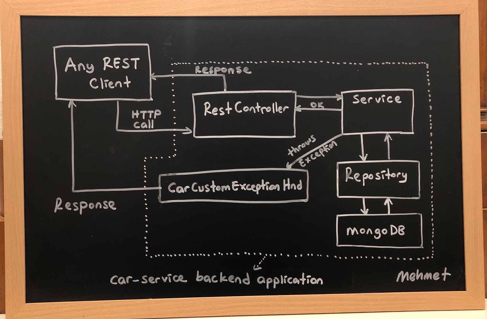

This project includes the backend microservice of the car service.





### 1. Run the following command to build and create backend jar file:
```sh
mvn package -Dmaven.test.skip=true
```

### 2. Run the following command to start the backend containers of the car-service:
```sh
docker-compose up
```


Resources:
1. https://www.udemy.com/course/spring-boot-egitimi/
2. https://www.toptal.com/java/spring-boot-rest-api-error-handling


